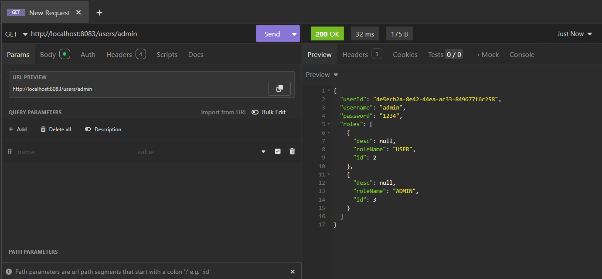

# JPA Demo - Spring Boot Application

Ce projet démontre l'utilisation de JPA/Hibernate avec Spring Boot pour gérer les utilisateurs et les rôles dans une base de données relationnelle.

## Structure du Projet

Le projet est organisé selon l'architecture en couches:
- `entities`: Contient les entités JPA (User, Role)
- `repositories`: Contient les interfaces de repositories Spring Data JPA
- `service`: Contient la logique métier
- `web`: Contient les contrôleurs REST

## Configuration de la Base de Données

Le projet est configuré pour utiliser MySQL par défaut, avec possibilité de basculer vers H2 pour les tests:

### Configuration MySQL (Active)
```properties
spring.datasource.url=jdbc:mysql://localhost:3306/jpa-demo-database?createDatabaseIfNotExist=true
spring.datasource.username=root
spring.datasource.password=
spring.jpa.hibernate.ddl-auto=create
spring.jpa.show-sql=true
spring.jpa.properties.hibernate.dialect=org.hibernate.dialect.MariaDBDialect
```

### Configuration H2 (Alternative pour tests)
```properties
spring.h2.console.enabled=true
spring.datasource.url=jdbc:h2:mem:users-db
```

## Démarrage et Test de l'Application

### 1. Démarrage de l'Application

Au démarrage, l'application crée automatiquement des données de test:


L'application affiche les logs de création des tables et d'insertion des données.

### 2. Structure de la Base de Données

La base de données créée contient 3 tables:


- `users`: Table des utilisateurs
- `role`: Table des rôles  
- `user_roles`: Table de jointure (Many-to-Many)

### 3. Test de l'API REST

#### Test avec l'utilisateur "hafid"

Réponse JSON:


#### Test avec l'utilisateur "admin"

Réponse JSON:



## Basculer vers H2

Pour utiliser H2 au lieu de MySQL, modifiez `application.properties`:

```properties
# Commenter la configuration MySQL
# spring.datasource.url=jdbc:mysql://localhost:3306/jpa-demo-database?createDatabaseIfNotExist=true
# spring.datasource.username=root
# spring.datasource.password=

# Décommenter la configuration H2
spring.h2.console.enabled=true
spring.datasource.url=jdbc:h2:mem:users-db
```

## Points Clés Démontrés

1. **Mapping JPA**: Utilisation des annotations `@Entity`, `@Table`, `@ManyToMany`
2. **Relations**: Implémentation de la relation Many-to-Many bidirectionnelle
3. **Spring Data JPA**: Utilisation des repositories pour l'accès aux données
4. **Configuration**: Basculement facile entre MySQL et H2
5. **API REST**: Exposition des données via des endpoints REST
6. **Gestion des transactions**: Utilisation de `@Transactional`

## Conclusion

Ce projet démontre une implémentation complète d'une application Spring Boot avec JPA, couvrant:
- La modélisation des entités avec relations
- L'accès aux données avec Spring Data JPA  
- La logique métier dans les services
- L'exposition via API REST
- La configuration de base de données flexible